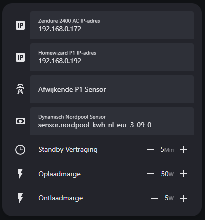
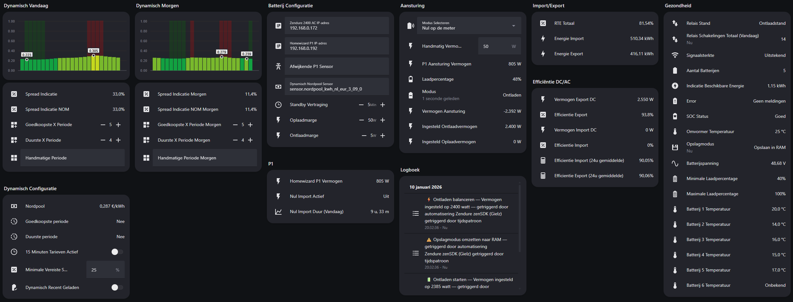
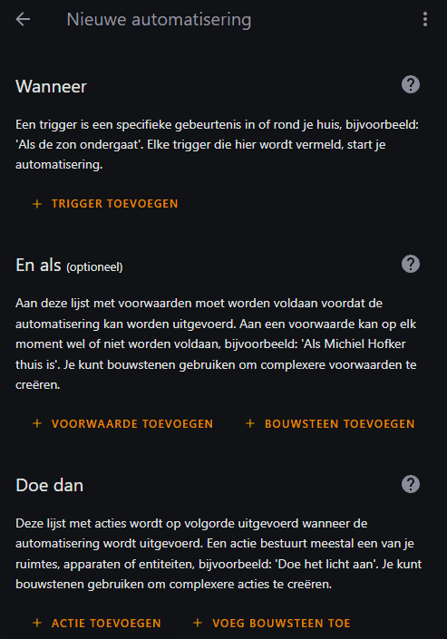
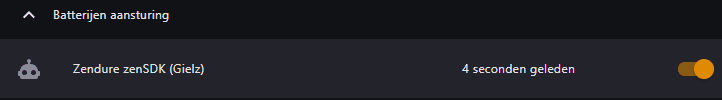
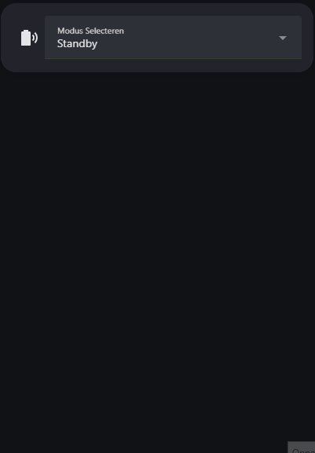
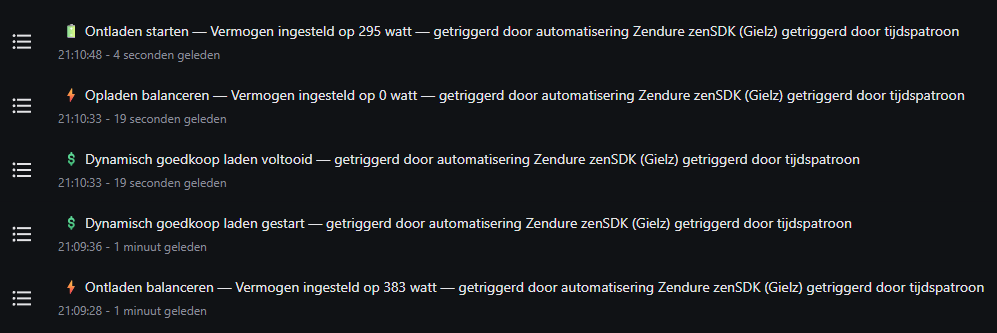

#  Zendure - Home Assistant
**Om in 2️⃣ stappen je batterij lokaal werkend te krijgen in Home Assistant**.

Gebaseerd op de [zenSDK RESTful API](https://github.com/Zendure/zenSDK) voor Home Assistant. Deze setup maakt lokaal verbinding met één Zendure Solarflow 2400 AC / Zendure Solarflow 800 Pro en Plus (geen aangesloten zonnepanelen) zonder gebruik te maken van integraties maar werkt met **één automatisering**. Voor de gene die graag de batterij 100% lokaal in eigen beheer wilt zonder updates van derden en netjes in Home Assistant. Inmiddels zijn er **10 uitgeprogrameerde modussen** waar in de batterij kan staan waardoor er voor iedereen wel iets tussen zit. De Nul op de Meter modus is uiteraard de meest gebruikte variant.

Heb je meerdere batterijen dan kan dit in combinatie met https://github.com/gast777/Zendure-zenSDK-proxy waarbij Node-RED gebruikt word.

Vind je dit project leuk en wil je mij steunen? Trakteer mij dan op een kopje koffie ☕️ – ik codeer beter met cafeïne!

  

## 1️⃣ Configuration.yaml

> ⚠️ Let op: Zorg ervoor dat **HEMS is uitgeschakeld** in de Zendure-app.

Daarna gaan wij alles aanmaken voor de RESTful integratie (zit standaard in HA). Hiervoor heb ik een bijna plug-n-play Configuration.yaml gemaakt.
#### ℹ️ Benodigde hardware

- Homewizard P1 (of een andere P1/CT-meter die data per seconden levert (+watt afname is en -watt teruglevering)).
- één Zendure Solarflow 2400 AC / Zendure Solarflow 800 Pro of Plus (geen aangesloten zonnepanelen).

---

### #️⃣ Configuratie en herstart

1. Maak eerst een **backup** van je `configuration.yaml`.
2. Pas daarna je `configuration.yaml` aan door gebruik te maken van de Github `configuration.yaml`.
3. Herstart Home Assistant.
5. Vul nu bij de onderstaande entiteiten de juiste gegevens in en herstart Home Assistant nogmaals. Dit is niet in de configuration.yaml maar open de entiteiten zoals is te zien op de onderstaande screenshot.

| Configuratie| Extra info|
|-|-|
| `input_text.zendure_2400_ac_ip_adres`      | In de Zendure app onder device Information |
| `input_text.homewizard_p1_ip_adres`    | In de Homewizard app (lokale API aanzetten)  |
| `input_text.afwijkende_p1_sensor` | **Optioneel** – bijvoorbeeld. `sensor.eigen_P1` – je eigen afwijkende P1 sensor toevoegen waarbij +watt afname is en -watt teruglevering (vul je hier je eigen sensor in dan is deze altijd leidend)  |
| `input_text.dynamisch_nordpool_sensor` | **Optioneel** – bijvoorbeeld `sensor.nordpool_kwh_nl_eur_3_09_0` – je eigen sensor van Nordpool (HACS) toevoegen.  |
| `input_text.zendure_2400_ac_batterij_volgorde` | **Optioneel** – bijvoorbeeld **1;5;3;4;2** – hiermee bepaal je zelf de volgorde van de batterijen. De juiste volgorde bepaal je mede aan de hand van `sensor.zendure_2400_ac_batterij_serienummers` en de sticker op de batterij(en). Op deze manier zullen de batterijtemperaturen en het laadpercentage de juiste volgorde hebben zoals die van de batterij(en) in de stapel.|
| `input_number.zendure_2400_ac_standby_vertraging` | **Optioneel** – 5-30 minuten tot wanneer de omvormer 100% in standby gaat bij 0 activiteit. Voorkomt sluipverbruik van +/- 19 watt |
| `input_number.zendure_2400_ac_oplaadmarge` | **Optioneel** – 0-50 watt minder meenemen tijdens opladen. Als je net wat minder wilt opladen (Zendure zelf hanteert hier 50 watt in HEMS) |
| `input_number.zendure_2400_ac_ontlaadmarge` | **Optioneel** – 0-50 watt extra meenemen tijdens ontladen. Als je net wat meer wilt ontladen |

 

*Zelf toe te voegen entiteiten op een dashboard. (Graphite theme, Numberbox-card, Apexcharts-card)
 

| Categorie              | Entiteiten                              | Uitleg / Inhoud                                                        |
| ---------------------- | -------------------------------------- | ------------------------------------------------------------ |
| Configuratie           | Zendure 2400 AC IP-adres               | bijvoorbeeld **192.168.0.172**                                       |
|                        | Homewizard P1 IP-adres                 | bijvoorbeeld **192.168.0.192**                                       |
|                        | Afwijkende P1 Sensor                   | bijvoorbeeld sensor.eigen_P1 waarbij +watt afname is en -watt teruglevering (vul je hier je eigen sensor in dan is deze altijd leidend)                                        |
|                        | Dynamisch Nordpool Sensor              | bijvoorbeeld `sensor.nordpool_kwh_nl_eur_3_09_0`                      |
|                        | Batterij Volgorde                      | bijvoorbeeld **1;5;3;4;2** – hiermee bepaal je zelf de volgorde van de batterijen. De juiste volgorde bepaal je mede aan de hand van `sensor.zendure_2400_ac_batterij_serienummers` en de sticker op de batterij(en). Op deze manier zullen de batterijtemperaturen en het laadpercentage gelijk lopen met die van de batterij(en) in de stapel.                  |
|                        | Standby Vertraging                     | 5-30 minuten tot wanneer de omvormer 100% in standby gaat bij 0 activiteit. Voorkomt sluipverbruik van +/- 19 watt                      |
|                        | Oplaadmarge                            | 0-50 watt minder meenemen tijdens opladen. Als je net wat minder wilt opladen (Zendure zelf hanteert hier 50 watt in HEMS)                          |
|                        | Ontlaadmarge                           | 0-50 watt extra meenemen tijdens ontladen. Als je net wat meer wilt ontladen                    |
| P1                     | Homewizard P1 Vermogen                 | Vermogen van je Homewizard P1                                |
|                        | P1 Nul Import Actief                   | Geeft aan dat er op dit moment geen import nodig is          |
|                        | P1 Nul Import Duur (Vandaag)           | Hoeveel nul import uren heb je vandaag bereikt               |
| Aansturing             | Modus Selecteren                       | Zie **Modus uitleg bij ✅ Batterij mag aan de slag**        |
|                        | Handmatig Vermogen                     | Gebruikt in modus **Handmatig**                              |
|                        | P1 Aansturing Vermogen                 | Homewizard P1 of afwijkende P1 sensor                        |
|                        | Laadpercentage                         | 5-100%                                                       |
|                        | Resterende Ontlaad Tijd                | uur - minuten (⚠️ Foutief door bug in API)                   |
|                        | Modus                                  | Opladen, Ontladen of Standby                                 |
|                        | Vermogen Aansturing                    | -2400-2400 watt (vermogen import en vermogen export)          |
|                        | Vermogen Import                        | 0-2400 watt                                                  |
|                        | Vermogen Export                        | 0-2400 watt                                                  |
|                        | Ingesteld Ontlaadvermogen              | 0-2400 watt                                                  |
|                        | Ingesteld Oplaadvermogen               | 0-2400 watt                                                  |
| Import/Export          | RTE Totaal                             | 0-100% (⚠️ extern meten via HomeWizard kWh Meter is aan te raden)|
|                        | Energie Import                         | KWH                                                          |
|                        | Energie Export                         | KWH                                                          |
| Efficiëntie DC/AC      | Vermogen Export (DC)                   | 0-2400 watt                                                  |
|                        | Efficiëntie Export                     | 0-100%                                                       |
|                        | Vermogen Import (DC)                   | 0-2400 watt                                                  |
|                        | Efficiëntie Import                     | 0-100%                                                       |
|                        | Efficiëntie Import (24u gemiddelde)    | 0-100%                                                       |
|                        | Efficiëntie Export (24u gemiddelde)    | 0-100%                                                       |
| Gezondheid             | Relais Stand                           | Oplaadstaand of Ontlaadstand                                 |
|                        | Relais Schakelingen Totaal (Vandaag)   | Beperk deze tot ±50 per dag. Bij bewolkte dagen ±100 per dag |
|                        | Signaalsterkte                         | Uitstekend, Goed, Zwak of Slecht                             |
|                        | Aantal Batterijen                      | 1-6                                                          |
|                        | Indicatie Beschikbare Energie          | 0 - 16,42 kwh                                                |
|                        | Error                                  | Geen meldingen of Zie Zendure APP                            |
|                        | SOC Status                             | Goed of Kalibreren                                           |
|                        | Omvormer Temperatuur                   | 0-100 °C                                                     |
|                        | Opslagmodus                            | Opslaan in RAM of Opslaan in Flash                           |
|                        | Batterijspanning                       | Voltage                                                      |
|                        | Minimale Laadpercentage                | 5-100%                                                       |
|                        | Maximale Laadpercentage                | 5-100%                                                       |
|                        | Batterij 1-6 Temperatuur               | 0-100 °C                                                     |
| Dynamisch              | Dynamisch Nordpool                     | Nordpool prijzen in 15min en 1uur                            |
|                        | Dynamisch 15 Minuten                   | Prijzen in 15 minuten ipv 1 uur prijzen                      |
|                        | Dynamisch Handmatige Periode           | bijvoorbeeld **G11:00;D12:00;G15:00** of **Geen**                   |
|                        | Dynamisch Handmatige Periode Morgen    | bijvoorbeeld **G11:00;D12:00;G15:00** of **Geen**                   |
|                        | Dynamisch Minimale Spread              | Gebruikt in modus **Dynamisch NOM**, **Dynamisch NOM (Duur)** em **Dynamisch Handelen**. Boven minimale spread laden     |
|                        | Dynamisch Spread Indicatie             | Berekening spread                                            |
|                        | Dynamisch Spread Indicatie NOM         | Berekening spread NOM, duurste na eerste laadactie           |
|                        | Dynamisch Spread Indicatie Morgen      | Berekening spread                                            |
|                        | Dynamisch Spread Indicatie NOM Morgen  | Berekening spread NOM, duurste na eerste laadactie           |
|                        | Dynamisch Goedkoopste Periode          | Ja of Nee                                                    |
|                        | Dynamisch Duurste Periode              | Ja of Nee                                                    |
|                        | Dynamisch Goedkoopste X Periode        | 1-96                                                         |
|                        | Dynamisch Duurste X Periode            | 1-96                                                         |
|                        | Dynamisch Goedkoopste X Periode Morgen | 1-96                                                         |
|                        | Dynamisch Duurste X Periode Morgen     | 1-96                                                         |
|                        | Dynamisch Recent Geladen               | Word automatisch aan en uit gezet. Om te voorkomen dat er laadgedrag van 99>100>99>100 SOC ontstaat   |
| Geen categorie         | Serienummer                            | Serienummer omvormer                                         |

## 2️⃣ Zendure zenSDK (Gielz) automatisering
De motor van alles. Deze zal slim opladen en slim ontladen en samen dansen tot één geheel. Heb je bij het bovenstaande geen namen aangepast dan is het een kwestie van een nieuwe automatisering aanmaken.

1. Maak een nieuwe automatisering aan.
2. Klik rechtsboven op **Bewerken in YAML**.
3. Plak de YAML-code `(zie automatisering bestand)`.
4. Sla op, en start de automatisering.

   

 

  

## ✅ Batterij mag aan de slag
Het is dan eindelijk zo ver de batterij mag eens laten zien wat hij kan.

1. Voeg de entiteit **Zendure 2400 AC Modus Selecteren** toe aan je dashboard.
2. Voeg eventueel andere entiteiten toe die je via de `configuration.yaml` hebt aangemaakt.
3. De modus zal op **Standby** staan.
4. Kies hier je gewenste modus om de **Zendure zenSDK (Gielz) automatisering** te activeren.
5. De batterij zal nu aan de slag gaan.

 

| Modus                         | Werking                               | Doel                                | 
| ----------------------------- | -------------------------------------- | -------------------------------------- | 
| Standby                | Zet volledig in standby en `sensor.zendure_2400_ac_opslagmodus` zal naar **Opslaan in Flash** gaan. Hierdoor is het ook 0 watt op een KWH MID Meter.                                       | 100% standby, de batterij gebruikt nog 0,2 kwh per dag.|
| Handmatig              | Via `input_number.zendure_2400_ac_handmatig_vermogen` kun je zelf aangeven wat de batterij doet. -watt voor ontladen en +watt voor opladen.       | Voor als je zelf aan de knoppen wilt draaien. |
| Nul op de meter        | Constant 0 op de meter behouden (-xx watt bij opladen en -xx watt bij ontladen). Je kunt het opladen finetunen via `input_number.zendure_2400_ac_oplaadmarge` waarbij je aangeeft hoeveel buffer/marge hij moet behouden tot 0 watt. Het ontladen kun je finetunen via `input_number.zendure_2400_ac_ontlaadmarge` waarbij je aangeeft hoeveel extra watt hij moet ontladen boven op 0 op de meter. Beide zijn handig om vaste kleine schommelingen in je huisverbruik standaard te compenseren.              | Zo min mogelijk energie importeren en exporteren |
| Dynamisch NOM          | ⚠️ Let op: Alleen te gebruiken met Nordpool sensor. Vul als eerste in hoeveel uren je goedkoop zou willen laden per dag via `input_number.dynamisch_goedkoopste_x_periode_morgen` dit is bijvoorbeeld 3 uur. Vervolgens vul je de overige duurste uren in via `input_number.dynamisch_duurste_x_periode_morgen` dit is bijvoorbeeld 21 uur. Wanneer nu `sensor.dynamisch_goedkoopste_periode` op JA staat zal er opgeladen worden indien `sensor.dynamisch_spread_indicatie_nom` hoger is dan `input_number.dynamisch_minimale_spread`. Wanneer `sensor.dynamisch_goedkoopste_periode` erg lang op JA staat zal hij pas weer gaan laden wanneer de batterij ontladen is tot 90%. Hij zal na laden constant 0 op de meter behouden (-xx watt bij opladen en -xx watt bij ontladen) en elke dag het dyanamisch laden uitvoeren.                                        | Alle goedkope energie uitspreiden over de dag |
| Dynamisch NOM (Duur)          | ⚠️ Let op: Alleen te gebruiken met Nordpool sensor. Vul als eerste in hoeveel uren je goedkoop zou willen laden per dag via `input_number.dynamisch_goedkoopste_x_periode_morgen` dit is bijvoorbeeld 3 uur. Vervolgens vul je de overige duurste uren in via `input_number.dynamisch_duurste_x_periode_morgen` dit is bijvoorbeeld 3 uur. Wanneer nu `sensor.dynamisch_goedkoopste_periode` op JA staat zal er opgeladen worden indien `sensor.dynamisch_spread_indicatie` hoger is dan `input_number.dynamisch_minimale_spread`. Wanneer `sensor.dynamisch_goedkoopste_periode` erg lang op JA staat zal hij pas weer gaan laden wanneer de batterij ontladen is tot 90%. Mocht er nog ruimte zijn om meer op te laden zal hij dit bij teruglevering gaan doen. Wanneer `sensor.dynamisch_duurste_periode` op JA staat zal hij NOM gaan ontladen en de rest van de tijd staat de batterij in standby.                                  | Alle goedkope energie specifiek gebruiken op de duurste uren |
| Dynamisch Handelen          | ⚠️ Let op: Alleen te gebruiken met Nordpool sensor. Vul als eerste in hoeveel uren je goedkoop zou willen laden per dag via `input_number.dynamisch_goedkoopste_x_periode_morgen` dit is bijvoorbeeld 3 uur. Vervolgens vul je de overige duurste uren in via `input_number.dynamisch_duurste_x_periode_morgen` dit is bijvoorbeeld 3 uur. Wanneer nu `sensor.dynamisch_goedkoopste_periode` op JA staat zal er opgeladen worden indien `sensor.dynamisch_spread_indicatie` hoger is dan `input_number.dynamisch_minimale_spread`. Wanneer `sensor.dynamisch_goedkoopste_periode` erg lang op JA staat zal hij pas weer gaan laden wanneer de batterij ontladen is tot 90%. Wanneer `sensor.dynamisch_duurste_periode` op JA staat zal hij op maximaal vermogen gaan ontladen en de rest van de tijd staat de batterij in standby.                                 | Energie inkopen en verkopen |
| Alleen slim ontladen   | Identiek aan **Nul op de meter** alleen zonder opladen.                                                |
| Alleen slim opladen    | Identiek aan **Nul op de meter** alleen zonder ontladen.                                               |
| Opladen met 2400 watt  | Snel opladen op maximaal vermogen.                                                                     |
| Ontladen met 2400 watt | Snel ontladen op maximaal vermogen.                                                                    |

#### ℹ️ Batterij Logboek
Wil je zien wat de batterij exact doet kijk dan eens in het logboek van `input_select.zendure_2400_ac_modus_selecteren`  
 

  

## 🔃 (Optioneel) Nordpool
Wanneer je ook het Dynamisch Nordpool gedeelte in gebruik gaat nemen moet je voor dat je deze in gebruik neemt bij `input_text.dynamisch_handmatige_periode` en
`input_text.dynamisch_handmatige_periode_morgen` even **unknown** weghalen. Hierna zal het dynamisch gedeelte werken. Alles wat in de forecast (morgen) gezet word zal overgenomen worden om 00:00 via de automatisering en verschijnen in vandaag.

Vervolgens kunnen de modussen **Dynamisch NOM**, **Dynamisch NOM (Duur)** en **Dynamisch Handelen** gebruikt worden. Deze modussen zijn ideaal in een periode met weinig zon maar wel met veel wind. Laad bijvoorbeeld in de winter de batterij een aantal uren goedkoop op iedere dag wanneer de spread meer dan 25% is.

### #️⃣ Apexcharts
Je kunt om het visueel aantrekkelijk te maken de Apexcharts `Nordpool_Apexcharts_Vandaag` en `Nordpool_Apexcharts_Morgen` gebruiken `(zie Github bestanden)`.
