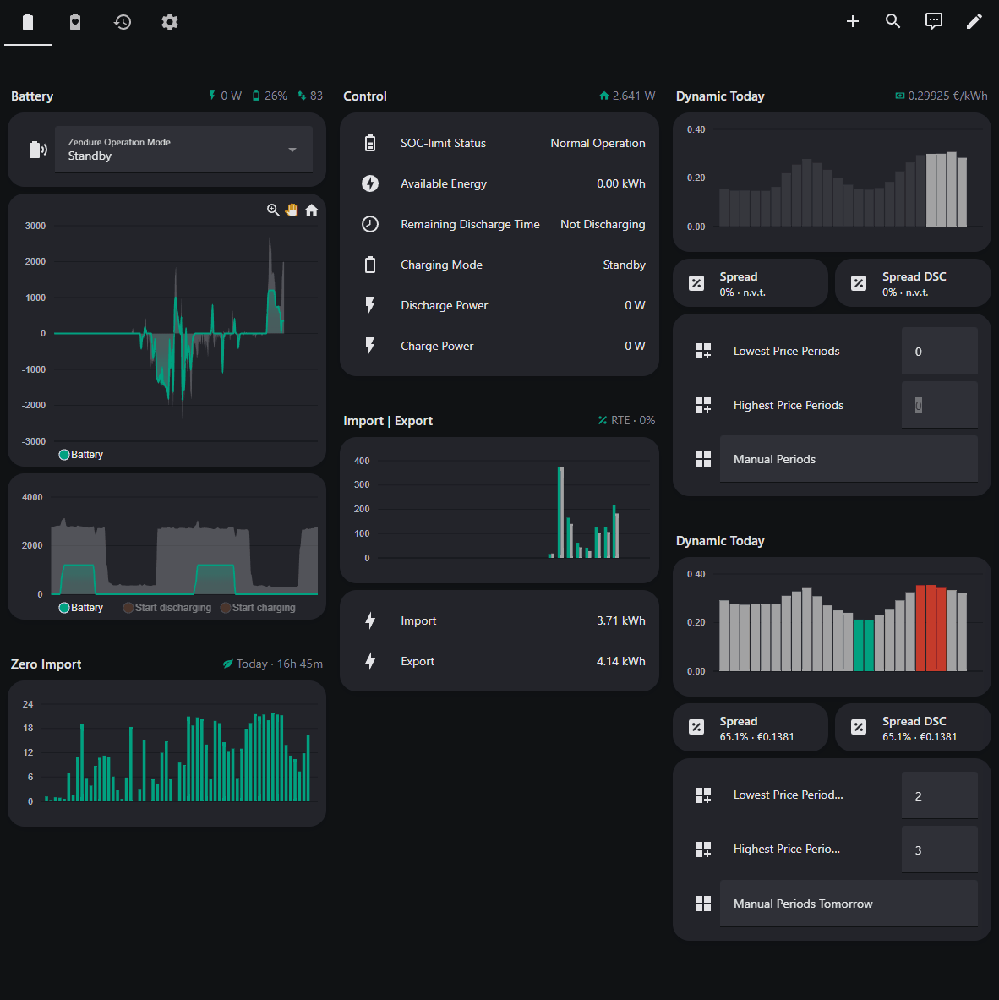
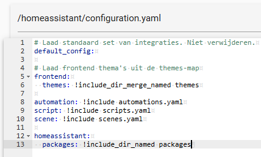
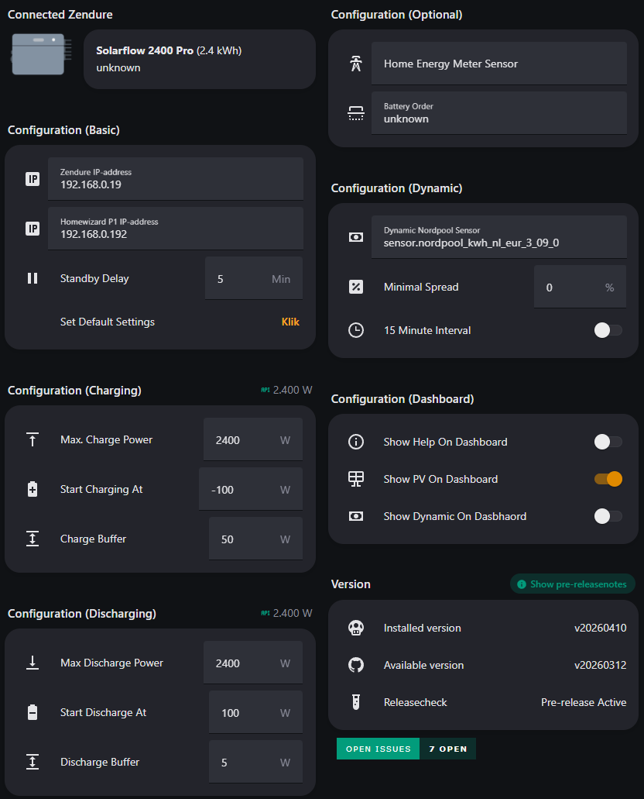
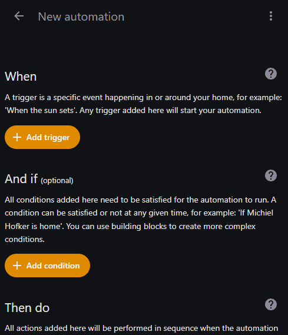
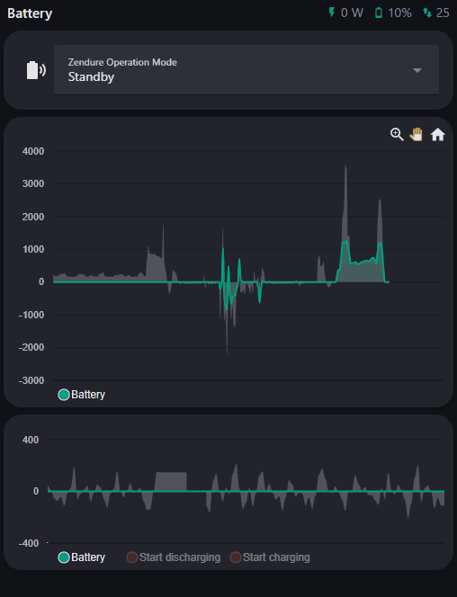
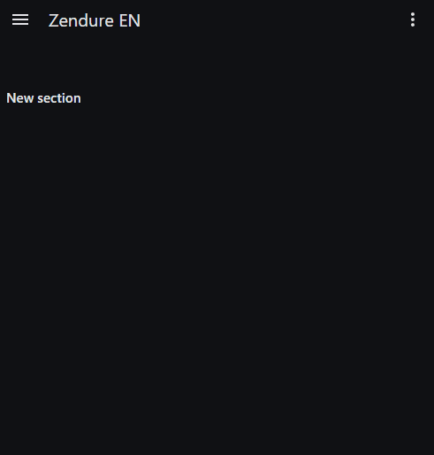

# Zendure Home Assistant Integration
 **English (Global)**  &nbsp;&nbsp;&nbsp;   **[Dutch (NL)](README.nl.md)**

[](https://github.com/Gielz1986/Zendure-HA-zenSDK/releases)
[](https://github.com/Gielz1986/Zendure-HA-zenSDK/issues)
[](https://github.com/Gielz1986/Zendure-HA-zenSDK/issues)

 <br>
<sub>
<a href="https://github.com/Gielz1986/Zendure-HA-zenSDK/wiki/Global-%E2%80%90-Available-entities">
Go to the explanation of all entities and the dashboard
</a>
</sub>

<br>

**Get your battery running locally in Home Assistant in just 2️⃣ simple steps.**

Based on the zenSDK RESTful API for Home Assistant. This package connects locally to one Zendure Solarflow 2400 (AC, AC+ or AC Pro) / Zendure Solarflow 1600 AC+ / Zendure Solarflow 800 (Pro or Plus). Perfect for anyone who wants to run their battery **100% local** in Home Assistant.

There are now **11 preconfigured modes** — from relaxed solar-based usage to acting like an energy trader with dynamic pricing for a few extra cents.

Do you have multiple inverters? Then you can expand this with the [Node-RED proxy by Gast777](https://github.com/gast777/Zendure-zenSDK-proxy). This proxy ensures everything in this automation works seamlessly together, allowing multiple identical inverters to be controlled intelligently with optimal power distribution.

Do you find this project useful and want to support further development?  
Buy me a coffee ☕️ and follow this GitHub repository ⭐⭐⭐.

<a href="https://www.buymeacoffee.com/gielz" target="_blank">
  
</a><br><br>


## 1️⃣ Making Entities Available

#### ℹ️ Required Hardware

- Homewizard P1 (or another home energy meter that provides per-second data (+watt import / -watt export)).
- One Solarflow 2400 (AC, AC+ or AC Pro) / Solarflow 1600 AC+ / Solarflow 800 (Pro or Plus).
- Or two identical inverters combined with the [Node-RED proxy by Gast777](https://github.com/gast777/Zendure-zenSDK-proxy)

---

### #️⃣ Configuration and Restart

1. Make sure **HEMS is disabled** in the Zendure app.
2. Place [Zendure_gielz1986_global.yaml](./Global%20(EN)%20Integration/packages/zendure_gielz1986_global.yaml) from the GitHub packages folder into your Home Assistant `packages` folder. If it does not exist, create it.
3. Create a **backup** of your `configuration.yaml`.
4. Then edit your `configuration.yaml` and add the following:

```
homeassistant:
  packages: !include_dir_named packages
```

|  |
|-----------------------------------|

5. Restart Home Assistant.
6. Optionally create the plug-n-play dashboard [Go to Plug-N-Play Dashboard](#-optional-plug-n-play-dashboard). Or fill in the entities below in Home Assistant and restart again.

---

  
<sub>*plug-n-play dashboard*</sub>

<br>

| Explanation per configuration item | |
|-|-|
| **Configuration (Basic)** | **Information** |
| `zendure_setting_ip_address` | **e.g. 192.168.0.172** – Found in the Zendure app under device information |
| `homewizard_setting_p1_ip_address` | **e.g. 192.168.0.192** – Enable local API in the Homewizard app |
| `zendure_setting_standby_delay` | **(Recommended: 15 minutes) 5–30 minutes** – Defines how quickly the inverter goes into full standby at 0 activity. Prevents ~19W idle consumption |
| `zendure_setting_set_default_settings` | Once the battery is running, you can use this to apply the recommended settings below |
| **Configuration (Charging)** | **Information** |
| `zendure_setting_max_charge_power` | **800–2400W** – Maximum charging power (up to 4800W with multiple inverters via Node-RED) |
| `zendure_setting_start_charging_at` | **(Recommended: -300W) -1000 to -100W** – Defines when charging starts |
| `zendure_setting_charge_buffer` | **(Recommended: 50W) 0–250W** – Determines how much less to include during charging. In summer you can increase this (e.g. 200W) to prevent daytime grid import |
| **Configuration (Discharging)** | **Information** |
| `zendure_setting_max_discharge_power` | **800–2400W** – Maximum discharge power (up to 4800W with multiple inverters via Node-RED) |
| `zendure_setting_start_discharging_at` | **(Recommended: 100W) 100–500W** – Defines when discharging starts |
| `zendure_setting_discharge_buffer` | **(Recommended: 5W) 0–250W** – Extra margin for discharging |
| **Configuration (Optional)** | **Information** |
| `home_energy_setting_meter_sensor` | **e.g. sensor.custom_energy** – Add your own home energy sensor (+watt import / -watt export). This will take priority. [Go to WIKI](https://github.com/Gielz1986/Zendure-HA-zenSDK/wiki/Global-and-NL-%E2%80%90-P1-CT-meters-(API's))) for P1/CT API's. |
| `zendure_setting_battery_order` | **e.g. 1;5;3;4;2** – Manually define battery order based on serial numbers and physical stacking |
| **Configuration (Dynamic)** | **Information** |
| `dynamic_setting_nordpool_sensor` | **e.g. sensor.nordpool_kwh_nl_eur_3_09_0** – Your Nordpool (HACS) sensor |
| `dynamic_setting_minimal_spread` | **e.g. 25%** – Minimum price spread before dynamic charging/discharging activates |
| `dynamic_setting_15_minute_interval` | Enable this if you want to use 15-minute intervals |
| **Configuration (Dashboard)** | **Information** |
| `dashboard_setting_show_help` | Enable to show help text on the dashboard |
| `dashboard_setting_show_pv` | Enable to show connected (offgrid/mppt) PV on the dashboard |
| `dashboard_setting_show_dynamic` | Enable to show dynamic control on the dashboard |

---

## 2️⃣ Zendure zenSDK (Gielz) Automation

The engine of everything: it charges smartly, discharges smartly, and ensures everything works together. Choose from 11 different modes to make it behave exactly how you want.

If you didn’t change any entity names above, you can simply create this automation:

1. Create a new automation.
2. Click **Edit in YAML**.
3. Paste the YAML code from [Automation_global.yaml](./Global%20(EN)%20Integration/automation_global.yaml).
4. Save and start the automation.

  


---

## ✅ Battery Ready to Go

The moment has arrived: time for your battery to prove it’s more than just an expensive decoration with cables.

1. Open the plug-n-play dashboard or add the entity **Zendure Operation Mode**.
2. The mode will be set to **Standby**.
3. Select your desired mode to activate the **Zendure zenSDK (Gielz)** automation.
4. The battery will with the desired operation mode.

  

<sub>
<a href="https://github.com/Gielz1986/Zendure-HA-zenSDK/wiki/Global-%E2%80%90-Operation-modes">
Go to the explanation of all modes
</a>
</sub>

---

## 🔃 (Optional) Plug-N-Play Dashboard

You can now also directly use a fully plug-n-play dashboard:

1. Requires [Apexcharts HACS](https://github.com/RomRider/apexcharts-card) and (optionally) [Graphite HACS](https://github.com/TilmanGriesel/graphite).
2. Create a new empty dashboard via ⚙️ and go to **Dashboards**.
3. Click **Add Dashboard** and choose **New dashboard from scratch**
4. Open the new dashboard.
5. Click on the 3 dots → **Edit Dashboard**.
6. Click on the 3 dots → **Raw configuration editor**.
7. Paste the YAML from [Dashboard_global.yaml](./Global%20(EN)%20Integration/dashboard_global.yaml).
8. Save — dashboard is ready to use.
9. [Go to the WIKI](https://github.com/Gielz1986/Zendure-HA-zenSDK/wiki/Global-%E2%80%90-Available-entities) for explanation of all entities.


